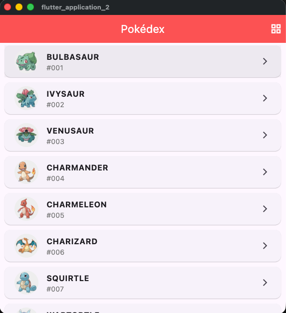
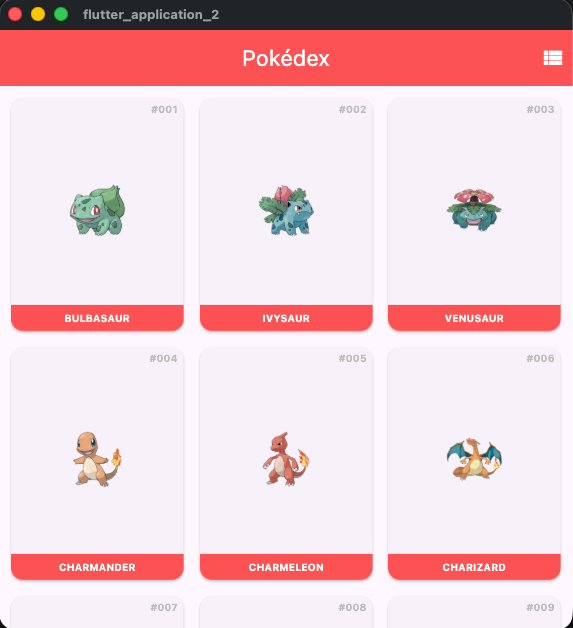
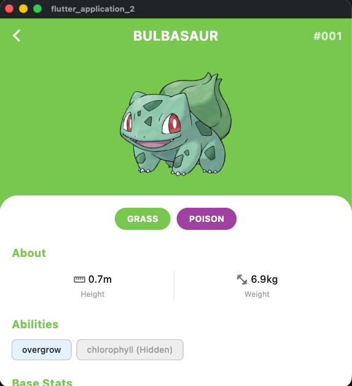

# Pokedex Flutter App

แอปพลิเคชัน Flutter สำหรับดูข้อมูล Pokemon จาก PokeAPI

## Screenshots

| List View | Grid View | Detail |
|-----------|-----------|--------|
|  |  |  |

## Features

- แสดงรายการ Pokemon แบบ List View และ Grid View
- Infinite Scroll โหลดข้อมูลเพิ่มเติมอัตโนมัติ
- หน้ารายละเอียดแสดง Types, Stats, Abilities
- Hero Animation

## Installation

```bash
flutter pub get
flutter run
```

## API

ใช้ [PokeAPI](https://pokeapi.co/)
